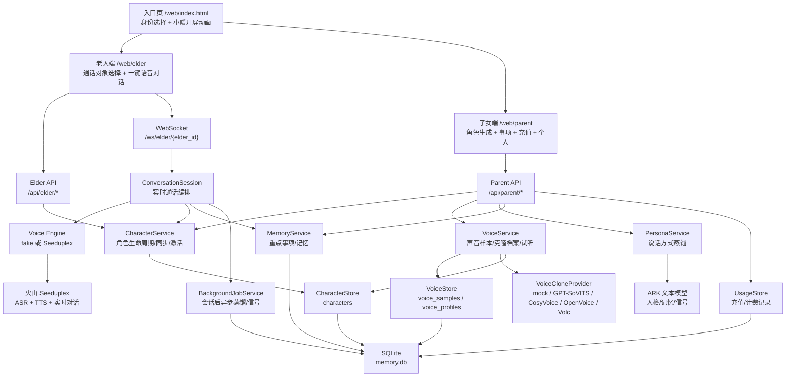
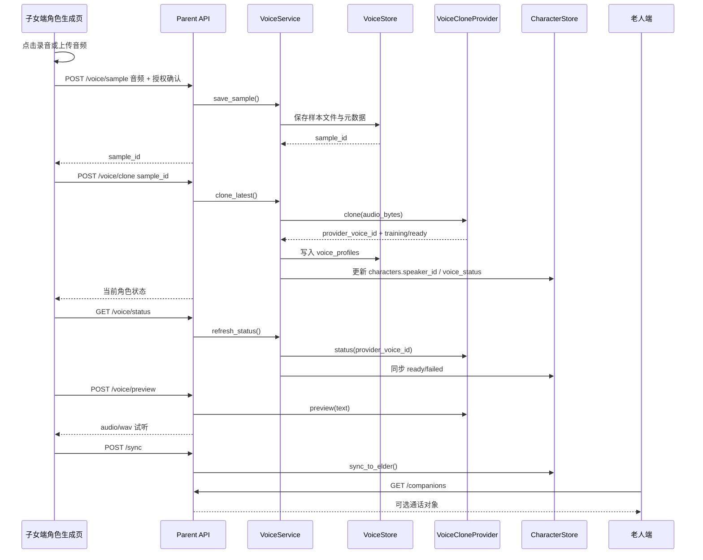

# 当前 App 架构图：声音克隆接入骨架

更新时间：2026-06-30

## 一句话架构

当前 App 采用「老人端轻交互 + 子女端配置角色 + 后端统一编排」结构。老人端只负责选择通话对象和发起语音对话；子女端负责创建角色、上传授权声音、生成说话方式、同步到老人端；后端把记忆、人格蒸馏、声音克隆、计费和实时语音会话隔离成独立服务。

## 总体架构图

## 声音克隆链路

## 当前模块职责

| 模块 | 当前职责 | 后续替换点 |
| --- | --- | --- |
| `web/parent/characters.html` | 子女端创建角色、录音/上传授权音频、生成说话方式、试听与同步 | 增加波形、录音时长校验、失败重试 |
| `backend/api/parent.py` | 父端 HTTP 写入口，承接声音样本、克隆任务、状态、试听 | 可加鉴权、家庭成员权限、审计日志 |
| `backend/voice/service.py` | 声音克隆应用编排，连接 VoiceStore、Provider、CharacterStore | 支持后台任务队列和多 provider 路由 |
| `backend/voice/store.py` | `voice_samples` 与 `voice_profiles` 持久化 | 样本可迁移到对象存储，DB 只保留 URI |
| `backend/voice/providers/base.py` | 克隆 provider 统一接口 | GPT-SoVITS/CosyVoice/OpenVoice/Volc 都实现此协议 |
| `backend/voice/providers/mock.py` | 本地演示 provider，生成 mock profile 与试听 wav | 生产环境替换为真实 provider |
| `backend/character/store.py` | 角色可见状态、同步状态、当前通话对象 | 可扩展角色排序、权限、版本回滚 |
| `backend/session/manager.py` | 老人端实时会话编排 | 接入 ready 的 speaker_id 后进行真实 TTS 发声 |

## Provider 接入建议

1. 近期 MVP：继续使用 `MockVoiceCloneProvider` 跑通产品交互、授权记录、同步和状态流转。
2. 本地开源方案：新增 `backend/voice/providers/gpt_sovits.py`，通过 HTTP 调用独立部署的 GPT-SoVITS 服务，返回内部 `provider_voice_id`。
3. 长期方案：新增 `cosyvoice.py` 或 `openvoice.py`，用队列异步提交训练/推理，`VoiceService` 不需要改前端 API。
4. 商业云方案：新增 `volc.py`，可复用现有火山 voice clone 封装，但把“手填 S_xxx”收敛到 provider 内部。

## 当前边界

- 老人端不出现克隆、上传、蒸馏、训练等工程动作，只看到“通话对象”。
- 子女端必须确认授权才能上传声音样本。
- 原始聊天记录不入库；音频样本当前落本地文件，后续生产环境建议迁移到加密对象存储。
- 真实克隆尚未接入 GPU/云服务，本次完成的是可插拔骨架和可跑通的 mock 交互。
