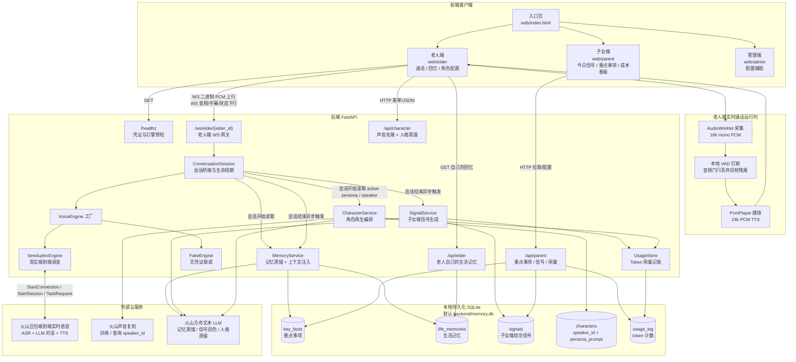
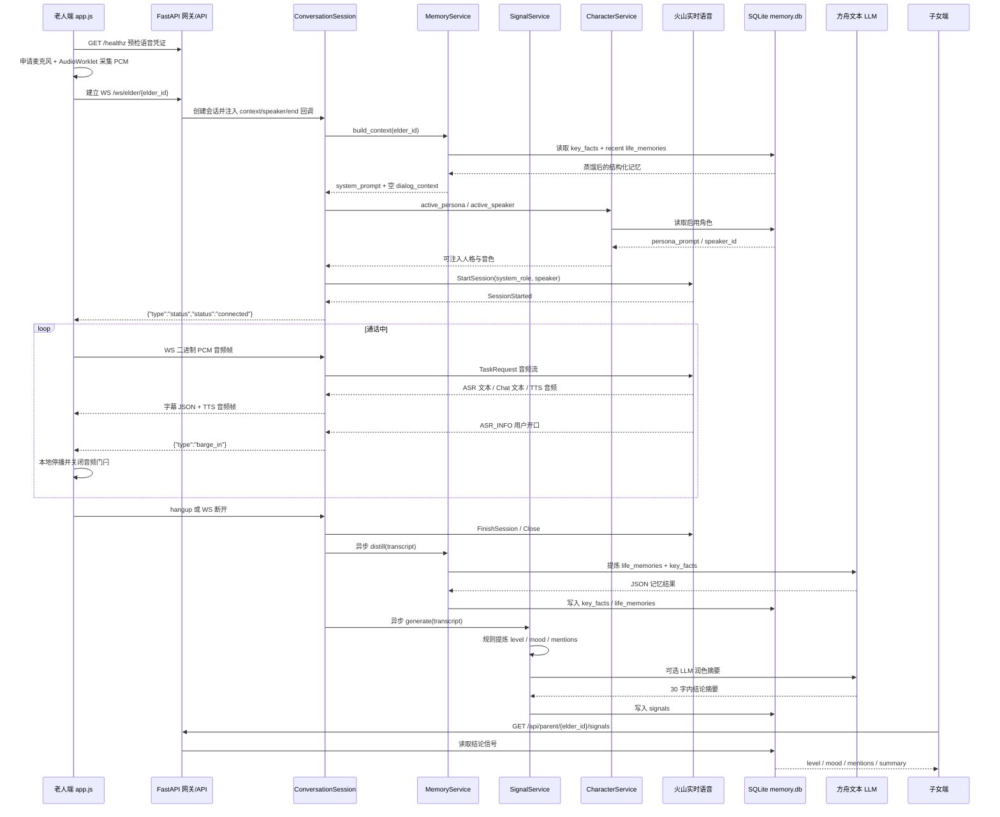

# 「小暖」核心技术架构图

> 当前仓库技术架构总览。API = 应用程序编程接口；WS = WebSocket 全双工长连接；ASR = 自动语音识别；TTS = 语音合成；LLM = 大语言模型；DB = 数据库。

## 1. 主架构图

## 2. 核心数据流图

## 3. 模块边界

| 边界 | 当前实现 |
|---|---|
| 实时通话 | 老人端只采集/播放音频，后端持有凭证并代理火山实时语音链路 |
| 记忆注入 | 新会话开始前读取 `key_facts` 与最近 `life_memories`，拼入 `system_prompt` |
| 记忆蒸馏 | 会话结束后异步调用方舟 LLM，失败只跳过本轮，不影响通话 |
| 子女端信号 | 会话结束后生成并落库，子女端通过 HTTP 拉取，不是服务端主动推送 |
| 角色再生 | `speaker_id` 注入 TTS 音色，`persona_prompt` 注入 system prompt 人格 |
| 隐私硬边界 | 原始对话只存在会话内存中；DB 只保存结构化记忆、结论信号和 token 计数 |

## 4. 当前架构的关键事实

1. 发声主链路只走 `VOLC_*` 对应的火山 openspeech 实时语音；`ARK_API_KEY` 不参与发声。
2. 方舟文本 LLM 只负责三类离线/异步任务：记忆蒸馏、信号摘要润色、人格蒸馏。
3. `ConversationSession` 是核心解耦点：它只依赖 `VoiceEngine` 抽象，不关心底层是真实 Seeduplex 还是 FakeEngine。
4. 子女端只能看到 `signals` 这类结论数据，看不到 `life_memories` 与原始对话。
5. `backend/memory.db` 是当前单机 MVP 的状态中心；后续多用户/多端并发扩展时，它是最明确的替换点。
