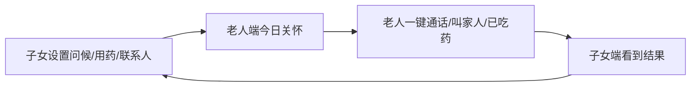

# 老人端功能评分提升与取舍建议

更新时间：2026-07-01

## 本轮已完成

1. 后端抽出 `ElderCareService` 与 `CareStore`，老人端 `today` 聚合不再写在 API 路由里。
2. 子女端新增“每日问候”配置，问候会持久化并同步到老人端首页。
3. 安心陪伴从静态按钮升级为服务端下发提醒策略，老人端开启后会低频播报问候/用药提醒，并在界面显示提示。
4. 新增结构化紧急联系人，老人端“叫家人”先确认再拨打，避免误触。
5. 新增结构化用药提醒与“我已吃药”确认，子女端可在照护记录里看到闭环。
6. 新增老人端行为日志，记录播放问候、通话失败、叫家人、确认吃药等关键动作。

## 当前打分变化

| 维度 | 修改前 | 修改后 | 变化原因 |
| --- | ---: | ---: | --- |
| 产品方向 | 8.0 | 8.8 | 从模板关怀变成家人可配置、老人可反馈的真实关怀 |
| 老人端体验完整度 | 5.5 | 7.6 | 增加每日问候、确认拨号、已吃药、安心提醒、失败兜底 |
| 代码可延展性 | 6.0 | 7.8 | 新增 care 服务层、结构化 care 表、行为日志，API 层变薄 |
| 可上线程度 | 4.0 | 6.4 | 关键闭环已有，但仍缺鉴权、通知、真机兼容和生产观测 |
| 可继续迭代程度 | 7.0 | 8.3 | 问候、提醒、紧急联系人、行为日志都有明确扩展点 |

## 继续提升分数应该新增什么

| 新增能力 | 提升维度 | 优先级 | 说明 |
| --- | --- | --- | --- |
| 多紧急联系人升级为顺序呼叫 | 安全性、上线程度 | P0 | 已支持多联系人和确认拨号，下一步需要“打不通换下一个” |
| 用药提醒重复规则 | 体验完整度、稳定性 | P0 | 已结构化药名/时间/剂量，下一步需要按天/周/月重复和漏服提醒 |
| 子女端问候录音 | 人文气息、差异化 | P1 | 文字问候已打通，下一步可让子女录 10 秒原声 |
| Web Push / 本地通知 | 安心陪伴完整度 | P1 | 当前提醒只在页面打开时有效，离开页面就失效 |
| 家庭共管审计 | 信任与协作 | P2 | 当前记录老人动作，下一步要记录谁设置了问候、联系人和用药 |

## 应该删除或降权什么

| 功能/入口 | 建议 | 原因 |
| --- | --- | --- |
| 老人端“切换身份” | 降权或隐藏到设置 | 老人端主路径里不应该频繁出现身份切换，容易误触 |
| 老人端底部过多导航 | 保留通话、关心我的事、通话对象，其他入口弱化 | 老人端越像 App，越难用 |
| 首页同时展示太多卡片 | 低优先卡片折叠 | 当前第一屏开始拥挤，通话按钮必须保持主视觉 |
| 技术状态文案 | 坚决不进老人端 | 老人不需要知道“训练中/同步中/克隆失败” |
| 频繁自动播报 | 严格限频 | 陪伴不是骚扰，安心模式必须低频、可关、可见 |

## 下一阶段建议目标

下一阶段不要继续横向加入口，而是做闭环：

最值得追的指标不是页面功能数，而是：

- 老人是否能在 3 秒内知道该点哪里。
- 子女写的一句话是否真的被老人听到。
- 用药/紧急联系是否形成闭环。
- 通话失败时老人是否仍然感到有人在。
